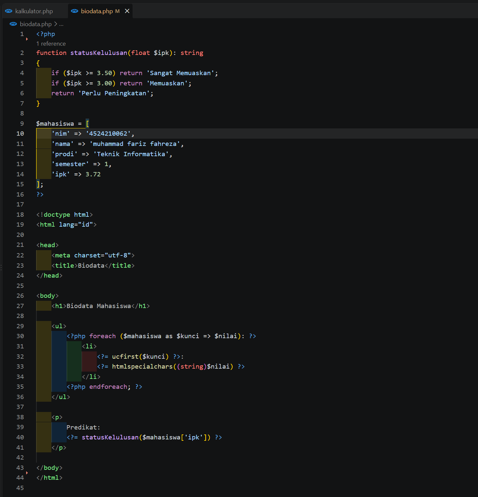
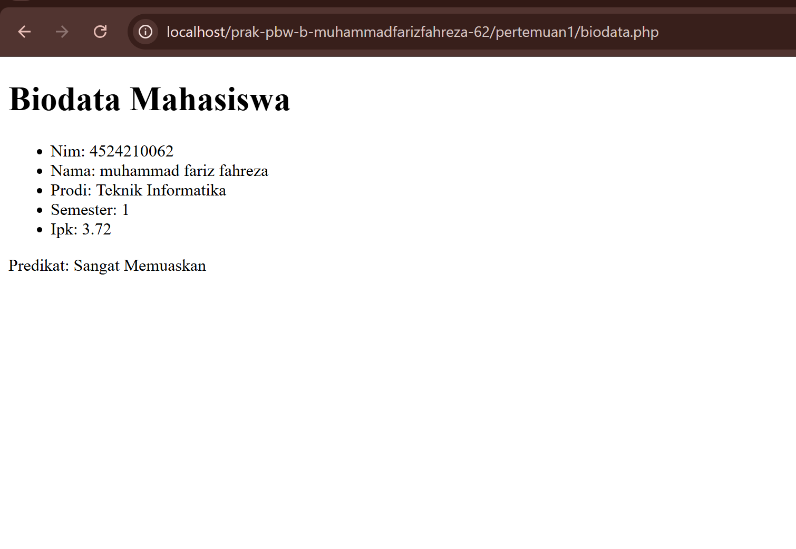
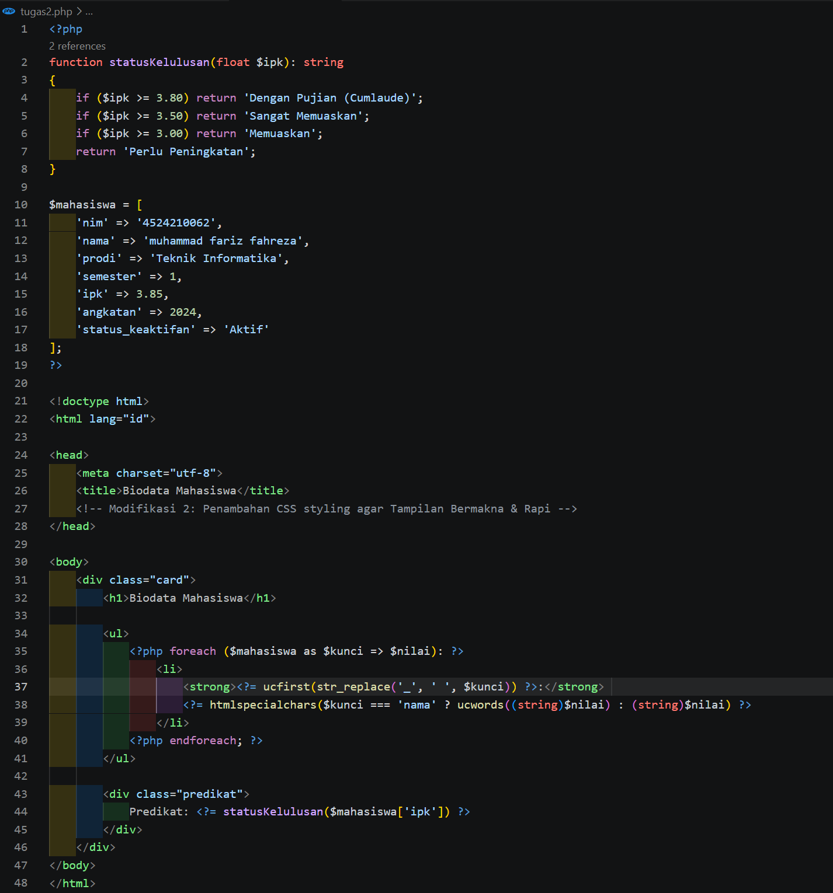
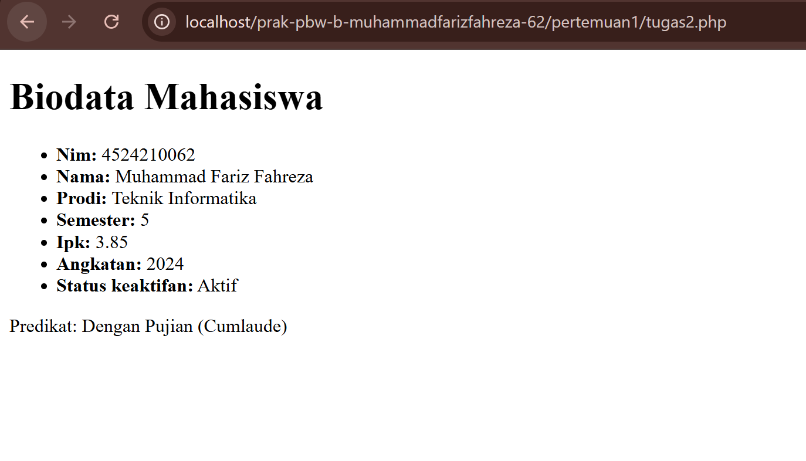

# Tugas 2 - Biodata Mahasiswa

## 1. Modifikasi Program
Pada tugas ini dilakukan 2 modifikasi bermakna pada program biodata mahasiswa:
1. **Penambahan Field Baru & Kondisi Predikat (Cumlaude)**: Menambahkan kriteria `Dengan Pujian (Cumlaude)` untuk IPK >= 3.80 serta menambahkan field `angkatan` dan `status_keaktifan` pada array asosiatif.
2. **Validasi IPK & Estimasi Tahun Lulus**: Menambahkan validasi rentang IPK (0.00 - 4.00) dan fungsi `hitungPerkiraanLulus()` untuk menghitung estimasi tahun kelulusan.

---

## 2. Penjelasan 5 Bagian Kode Paling Penting
1. **`function statusKelulusan(float $ipk): string`**: Menggunakan *type hinting* untuk memastikan parameter bernilai *float* dan mengembalikan string predikat.
2. **Array Asosiatif `$mahasiswa`**: Menyimpan data mahasiswa dalam format *key-value* yang fleksibel untuk ditambah data baru.
3. **`foreach ($mahasiswa as $kunci => $nilai)`**: Melakukan perulangan untuk menampilkan seluruh data array asosiatif secara dinamis ke HTML.
4. **`htmlspecialchars((string)$nilai)`**: Mencegah celah keamanan *Cross-Site Scripting* (XSS) pada data output.
5. **`ucfirst()` dan `ucwords()`**: Fungsi manipulasi string untuk memformat huruf kapital pada judul field dan nama mahasiswa.

---

## 3. Screenshot Sebelum dan Sesudah Modifikasi

### Kodingan Sebelum Modifikasi
### Kodingan Sebelum Modifikasi

### Output Sebelum Modifikasi

### Kodingan Sesudah Modifikasi

### Output Sesudah Modifikasi

---

## 4. Error yang Pernah Muncul
* **Error**: `Fatal error: Uncaught TypeError: statusKelulusan(): Argument #1 ($ipk) must be of type float, string given`
* **Penyebab**: Nilai IPK di dalam array ditulis sebagai string (`'3.72'`), padahal fungsi membutuhkan tipe data `float`.
* **Langkah Perbaikan**: Mengubah nilai IPK menjadi angka desimal tanpa tanda petik (`3.72`).