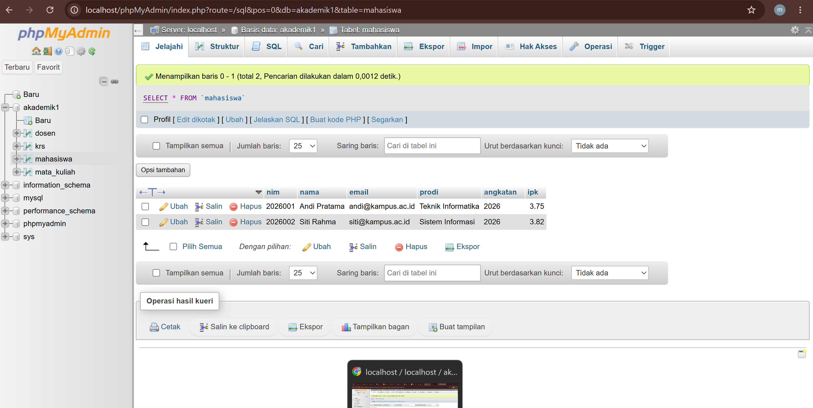

# Laporan Praktikum Pemrograman Berbasis Web - Pertemuan 3

## 1. Ringkasan

Dokumentasi ini berisi pelaksanaan Tugas Praktikum Individu untuk basis data akademik (`akademik1.sql`). Praktikum ini mencakup pembuatan struktur tabel relasional (Dosen, Mahasiswa, Mata Kuliah, dan KRS), implementasi *Foreign Key constraints*, pembatasan *Uniqueness*, serta manipulasi data dasar.

## 2. Struktur Basis Data (`akademik1.sql`)

Database terdiri dari 4 tabel utama yang terhubung secara relasional:

* **`dosen`**: Menyimpan data pengajar (`nidn` \[PK\], `nama`, `email` \[UNIQUE\]).

* **`mahasiswa`**: Menyimpan data mahasiswa (`nim` \[PK\], `nama`, `email` \[UNIQUE\], `prodi`, `angkatan`, `ipk`, `status_aktif`).

* **`mata_kuliah`**: Menyimpan mata kuliah (`kode_mk` \[PK\], `nama_mk`, `sks`, `nidn` \[FK ke dosen\]).

* **`krs`**: Tabel transaksi/kartu rencana studi (`id` \[PK AUTO_INCREMENT\], `nim` \[FK ke mahasiswa\], `kode_mk` \[FK ke mata_kuliah\], `semester`, `tahun_ajaran`, `nilai_huruf`).

## 3. Modifikasi yang Dilakukan

Sesuai instruksi tugas, dilakukan minimal dua modifikasi bermakna pada program/database:

1. **Modifikasi 1: Penambahan Field & Default Constraint pada Tabel `mahasiswa`**

   * **Deskripsi:** Menambahkan kolom `ipk` dengan tipe data `DECIMAL(3,2)` dan pengaturan default `status_aktif` menggunakan `ENUM('aktif','cuti','lulus')`.

   * **Tujuan:** Memungkinkan pencatatan performa akademik mahasiswa dan status keaktifan secara terstruktur.

2. **Modifikasi 2: Constraint Unik Gabungan (*Composite Unique Key*) pada Tabel `krs`**

   * **Deskripsi:** Menambahkan constraint `UNIQUE KEY uq_krs (nim, kode_mk, semester, tahun_ajaran)`.

   * **Tujuan:** Mencegah terjadinya duplikasi pengambilan mata kuliah yang sama oleh mahasiswa dalam satu semester dan tahun ajaran yang sama (Validasi integritas data).

## 4. Penjelasan 5 Bagian Kode Paling Penting

### A. Pengaturan Constraint *Foreign Key* dengan `ON DELETE CASCADE`

```
ALTER TABLE `krs`
  ADD CONSTRAINT `fk_krs_mahasiswa` 
  FOREIGN KEY (`nim`) REFERENCES `mahasiswa` (`nim`) 
  ON DELETE CASCADE ON UPDATE CASCADE;

```

> **Penjelasan:** Bagian ini menjaga referensial integritas antara tabel `krs` dan `mahasiswa`. Menggunakan `ON DELETE CASCADE` memastikan jika data mahasiswa dihapus, data KRS yang berhubungan akan otomatis ikut terhapus sehingga tidak ada *orphan data*.

### B. Validasi Unik Gabungan pada Tabel KRS

```
ADD UNIQUE KEY `uq_krs` (`nim`, `kode_mk`, `semester`, `tahun_ajaran`);

```

> **Penjelasan:** Mencegah input ganda. Seorang mahasiswa tidak bisa menginputkan `kode_mk` yang sama lebih dari sekali pada semester dan tahun ajaran yang sama.

### C. Constraint *Set Null* pada Mata Kuliah

```
ALTER TABLE `mata_kuliah`
  ADD CONSTRAINT `fk_mk_dosen` 
  FOREIGN KEY (`nidn`) REFERENCES `dosen` (`nidn`) 
  ON DELETE SET NULL ON UPDATE CASCADE;

```

> **Penjelasan:** Mengatur hubungan antara Dosen Pengampu dan Mata Kuliah. Jika data Dosen dihapus, kolom `nidn` di tabel `mata_kuliah` tidak ikut terhapus melainkan diubah menjadi `NULL` (`ON DELETE SET NULL`).

### D. Tipe Data Enum & Default Value

```
`status_aktif` enum('aktif','cuti','lulus') COLLATE utf8mb4_unicode_ci NOT NULL DEFAULT 'aktif'

```

> **Penjelasan:** Membatasi nilai input pada kolom `status_aktif` hanya pada 3 pilihan pasti, serta otomatis menetapkan status awal mahasiswa baru sebagai `'aktif'`.

### E. Auto Increment Primary Key

```
`id` bigint UNSIGNED NOT NULL AUTO_INCREMENT

```

> **Penjelasan:** Menjadikan kolom `id` sebagai penanda unik (*Primary Key*) otomatis untuk setiap transaksi KRS yang masuk, guna mempermudah query dan manajemen *record*.

## 5. Bukti Screenshots Modifikasi

*(Silakan lampirkan gambar pendukung di laporan Anda)*

| **Sebelum Modifikasi** | **Sesudah Modifikasi** | 


### Output Sebelum Modifikasi


| *Tampilan query/tabel awal* | *Tampilan hasil setelah ditambah constraint & kolom baru* | 

## 6. Analisis Error dan Perbaikannya

* **Error yang Pernah Muncul:**
  `ERROR 1452 (23000): Cannot add or update a child row: a foreign key constraint fails`

* **Penyebab:**
  Terjadi saat mencoba memasukkan data transaksi baru ke tabel `krs` menggunakan `nim` atau `kode_mk` yang belum terdaftar di tabel master (`mahasiswa` / `mata_kuliah`).

* **Langkah Perbaikan:**

  1. Pastikan data induk (*parent row*) pada tabel `mahasiswa` dan `mata_kuliah` disiapkan/di-insert terlebih dahulu.

  2. Lakukan pengecekan ulang nilai `nim` dan `kode_mk` pada query `INSERT INTO krs` agar sesuai dengan data yang tersedia di database.